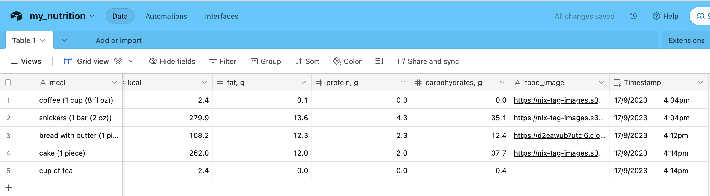

This repo contains several simple examples of using the [Function calling](https://platform.openai.com/docs/guides/gpt/function-calling) feature of OpenaAI API. Used during a presentation at the internal meeting in my company.

- **[openai_completion_api_example.py](openai_completion_api_example.py)** - this file has an example of calling the chat completions endpoint of OpenAI without function calling (for comparison)

- **[email_parsing.py](email_parsing.py)** - example of using Function calling to parse rather complex unstructured data into JSON (without actual function calling)

- **[get_nutrients_save_airtable.py](get_nutrients_save_airtable.py)** - a little bit more complicated example, which conditionally calls 2 functions: one for getting nutrients data (calories/fat/protein/carbohyrdates) for a given food using the [Nutritionix API](https://developer.nutritionix.com/admin/access_details), and another to save the resulting data to an [Airtable](https://airtable.com/) spreadsheet. 

